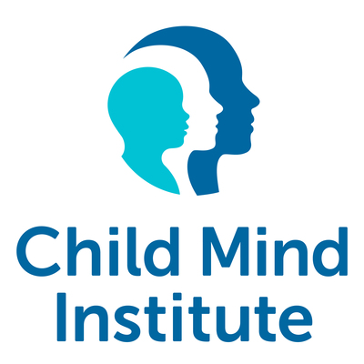

(Italian Version Below - [Go to the italian version](#Italian-Version-Below))

#  Child Mind Institute - Problematic Internet Use Challenge  

This repository contains my solution for the **Child Mind Institute - Problematic Internet Use** competition hosted on Kaggle.

## Challenge Description
The goal of this competition is to develop a machine learning model that can predict problematic internet use among children based on various behavioral and demographic factors.

More details about the competition can be found [here](https://www.kaggle.com/competitions/child-mind-institute-problematic-internet-use).

## Project Structure
- **Data**: All relevant data is provided by Kaggle and processed to clean and prepare it for model training.
- **Notebooks**: The project includes Jupyter notebooks that detail the data analysis, model building, and evaluation process.
- **Models**: Multiple models are tested and compared, including:
  - Scikit-learn based models.
  - Advanced models like LightGBM and XGBoost.

## Methodology
1. **Data Preparation**:
   - Initial data exploration and cleaning.
   - Feature selection and engineering.
   
2. **Modeling**:
   - Comparison of different algorithms, such as Random Forest, Gradient Boosting, and XGBoost.
   - Hyperparameter tuning to improve model performance.

3. **Evaluation**:
   - The models are evaluated using metrics such as accuracy, precision, recall, and F1-score.

## Results
The final model will be submitted to Kaggle for evaluation. The goal is to achieve high predictive accuracy by fine-tuning the parameters and selecting the most relevant features.

## Future Work
Potential improvements include:
- Exploring deep learning models for better predictions.
- Trying out more feature engineering techniques to improve model performance.

## Author
- **Daniele Pavan** - [GitHub Profile](https://github.com/PavanDaniele)

***
---

#  Child Mind Institute - Problematic Internet Use Challenge  

Questo progetto è parte della competizione Kaggle dedicata alla predizione dell'uso problematico di internet nei bambini.

## Descrizione
La challenge si concentra sulla creazione di un modello predittivo che identifichi  l'uso problematico di internet tra i bambini, basandosi su vari fattori comportamentali e demografici.

## Struttura del Progetto
- **Data**: Tutti i dati rilevanti sono forniti da Kaggle e vengono elaborati per essere puliti e preparati per l'addestramento del modello.
- **Notebooks**: Il progetto include notebook Jupyter che descrivono l'analisi dei dati, la costruzione dei modelli e il processo di valutazione.
- **Models**: Vengono testati e confrontati diversi modelli, tra cui:
  - Modelli basati su Scikit-learn.
  - Modelli avanzati come LightGBM e XGBoost.

 ## Metodologia
1. **Preparazione dei Dati**:
   - Esplorazione e pulizia iniziale dei dati.
   - Selezione e ingegnerizzazione delle caratteristiche.
   
2. **Modellazione**:
   - Confronto di diversi algoritmi, come Random Forest, Gradient Boosting e XGBoost.
   - Ottimizzazione degli iperparametri per migliorare le prestazioni del modello.

3. **Valutazione**:
   - I modelli sono valutati utilizzando metriche come accuratezza, precisione, richiamo e F1-score.

## Risultati
Il modello finale verrà inviato a Kaggle per la valutazione. L'obiettivo è raggiungere un'elevata accuratezza predittiva attraverso l'ottimizzazione dei parametri e la selezione delle caratteristiche più rilevanti.

## Lavoro Futuro
I potenziali miglioramenti includono:
- Esplorazione di modelli di deep learning per previsioni migliori.
- Sperimentazione di tecniche di feature engineering per migliorare le prestazioni del modello.

## Autore
- **Daniele Pavan** - [GitHub Profile](https://github.com/PavanDaniele)
